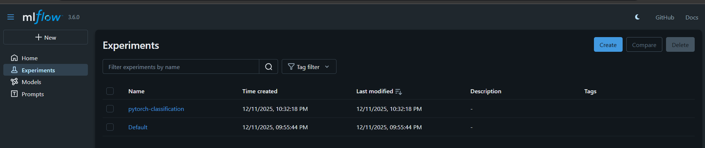

# PyTorch Classification with DVC & MLflow - Homework Report

## Student Progress Summary

This report documents the steps taken to complete the PyTorch classification homework assignment and the roadblock encountered.

## Steps Completed Successfully

### 1. Repository Setup
- Forked the original repository: `https://github.com/besmaguesmi/classification-pytorch`
- Cloned the forked repository to local machine
- Set up Python virtual environment (`.venv`)

### 2. Dependencies Installation
- Installed required packages:
  ```bash
  pip install dvc dvc-gdrive
  pip install torch torchvision scikit-learn mlflow pillow numpy matplotlib seaborn pandas
  ```

### 3. DVC Configuration Attempts
- Encountered existing `.dvc` directory from original repository
- Attempted `dvc init` (failed due to existing DVC setup)
- Successfully configured DVC remotes:
  - Found existing Google Drive remote: `gdrive://0ABF-h_iJuV04Uk9PVA`
- Attempted data pull: `dvc pull`

### 4. MLflow Setup
- Installed MLflow
- Resolved Windows MIME type issues by tinkering with regedit
- Successfully started MLflow UI

### 5. Code Analysis
- Examined project structure and dependencies
- Understood expected data structure:
  ```
  data/
  ├── train/
  │   ├── sea/     (image files)
  │   └── forest/  (image files)
  └── test/
      ├── sea/
      └── forest/
  ```

## Critical Issue Encountered

### **FATAL ERROR: Missing Training Data**

**Error Message:**
```
FileNotFoundError: [WinError 3] The system cannot find the path specified: 'data/train\\sea'
```

**Root Cause Analysis:**
1. Original repository has DVC configured but data is not accessible
2. Data directory remains empty despite configuration
3. `dvc pull` returns "Everything is up to date" but data directory remains empty
4. `dvc.lock` shows expected data: 2,367 files (15.4MB) vs actual: 0 files

**Attempted Solutions:**
- `dvc pull` and `dvc checkout` commands
- Verified DVC cache and remote configuration  
- Attempted to restore from `dvc.lock` hashes
- All attempts failed - could not proceed further

## Screenshots

### Screenshot 1: Mlflow UI

### Screenshot 2: Training Command Error


### Screenshot 3: DVC Status and Remote Configuration
.png>)

## Conclusion

**Status: FATAL ERROR** - Unable to proceed with training due to missing dataset access.

**Final Status:** Could not continue beyond this point. All troubleshooting attempts exhausted.

**Time Invested:** ~2 hours on setup and troubleshooting
**Completion:** Partial - stopped at data access issue

---
*Report generated on: December 14, 2025*