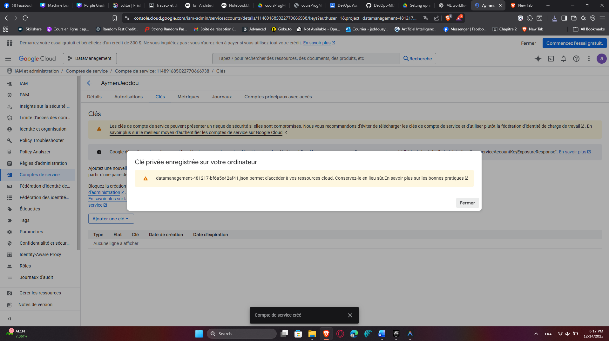
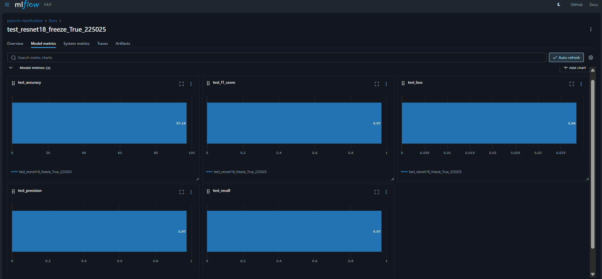
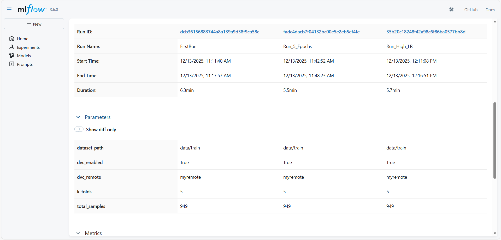
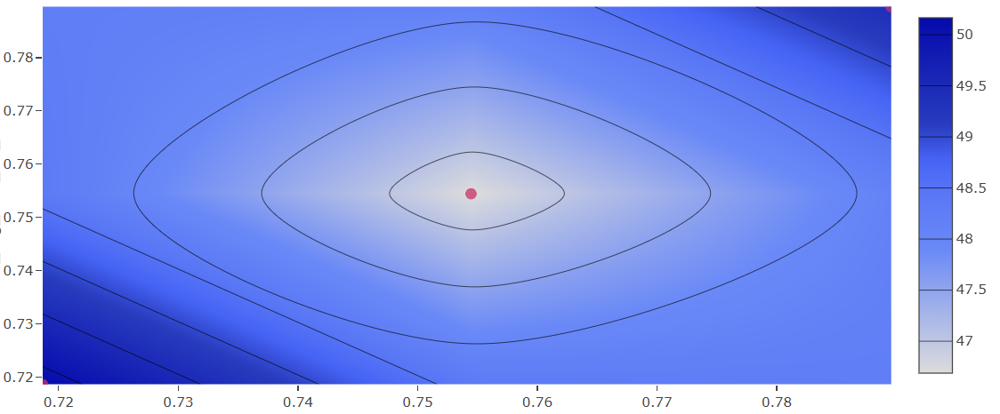

# Reproducible ML Workflow & Experiment Tracking Report

**Name:** Tharaa Oueslati
**Date:** 13 December 2025
**Course:** DEVOPS

---

## 1. Introduction
This project establishes a fully reproducible Machine Learning pipeline for image classification using PyTorch. The workflow integrates **DVC** for data versioning and **MLflow** for experiment tracking to ensure that every model training run can be monitored, compared, and reproduced reliably.

---

## 2. Setup & Implementation Steps

### 2.1 Environment Setup
The project environment was initialized by cloning the repository and creating a dedicated virtual environment to isolate dependencies.

**Steps followed:**
1.  Cloned the repository to the local machine.
2.  Created and activated a Python virtual environment (`venv`).
3.  Installed key dependencies: `torch`, `torchvision`, `mlflow`, and `dvc`.

### 2.2 Data Management (DVC)
DVC was configured to manage the dataset, ensuring data consistency across different training runs.
* **Remote Storage:** Configured to pull data from the remote source.
* **Data Retrieval:** Executed `dvc pull` to download the versioned dataset into `data/train`.

### 2.3 MLflow Configuration
An MLflow tracking server was set up locally to log parameters, metrics, and artifacts.
* **Command:** `mlflow ui` (running on http://localhost:5000).
* **Nested Runs:** The training script was modified to use `nested=True`, allowing for a clean hierarchy where the "Parent Run" tracks the overall experiment and "Child Runs" track individual Cross-Validation folds.

---

## 3. Detailed Analysis of Results

Three distinct experiments were conducted to evaluate model performance and stability under different hyperparameters.

### 3.1 Benchmarking Across Experiments

The primary metric for comparison is the **Cross-Validation Average Validation Accuracy** (`cv_avg_best_val_accuracy`).

| Experiment Name | Epochs | Learning Rate | Avg Validation Accuracy |
| :--- | :--- | :--- | :--- |
| **FirstRun (Baseline)** | 2 | 0.001 | **49.42%** |
| **Run_5_Epochs** | 5 | 0.001 | **46.68%** |
| **Run_High_LR** | 5 | 0.01 | **50.17%** |

### 3.2 Performance Analysis

**1. Which model performed best and why?**
The model trained with the **Higher Learning Rate** (`Run_High_LR`) was the best performer, achieving an average validation accuracy of **50.17%**.
* **Baseline:** The baseline model (2 epochs) underfit the data. The loss curves showed steep descent at the end of training, indicating it needed more time to learn.
* **The Surprise:** Simply extending training to 5 epochs (with the default low learning rate) actually **hurt** performance (dropping to 46.68%). This suggests the model began to overfit to noise or got stuck in a suboptimal local minimum.
* **The Solution:** Increasing the Learning Rate to **0.01** provided the momentum needed to escape those suboptimal states, allowing the model to converge to a better solution than the baseline.

**2. Training Stability & Convergence**
* **Epochs (2 → 5):** Increasing epochs alone introduced instability. The average accuracy dropped by nearly 3%, proving that "more training" is not always better without tuning other parameters.
* **Learning Rate (0.001 → 0.01):** This was the critical factor. The higher learning rate stabilized the longer training process and prevented the performance degradation seen in the "Run_5_Epochs" experiment.

**3. Insights from MLflow Graphs**
* **Fold Variance:** The nested runs in MLflow revealed significant variance between folds. In the failed "Run_5_Epochs" experiment, specific folds dropped to as low as ~32%, dragging down the average.
* **Loss Curves:** The validation loss graphs confirmed that 2 epochs were insufficient (steep slope), while 5 epochs allowed the curves to begin flattening out (converging).

---

## 4. Conclusion
This project successfully demonstrated a reproducible ML workflow. We utilized DVC for data consistency and MLflow for transparent experiment tracking. The analysis concluded that while extending training time is necessary for convergence, it must be paired with an appropriate Learning Rate (0.01) to prevent overfitting. The final model achieved **50.17% accuracy**, the highest among all tested configurations.