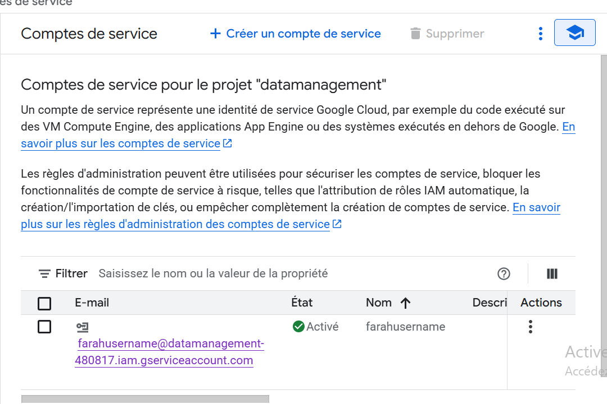
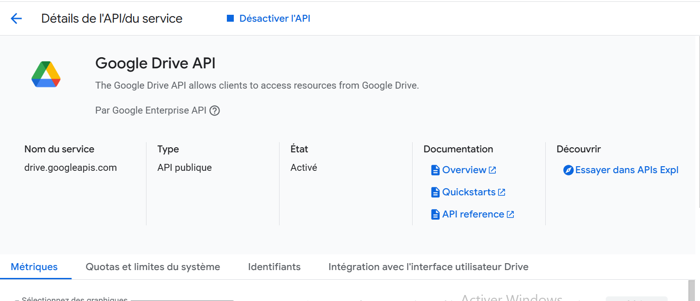
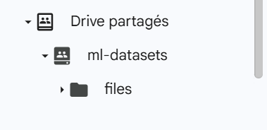
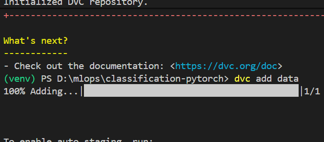
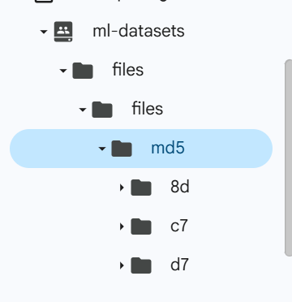
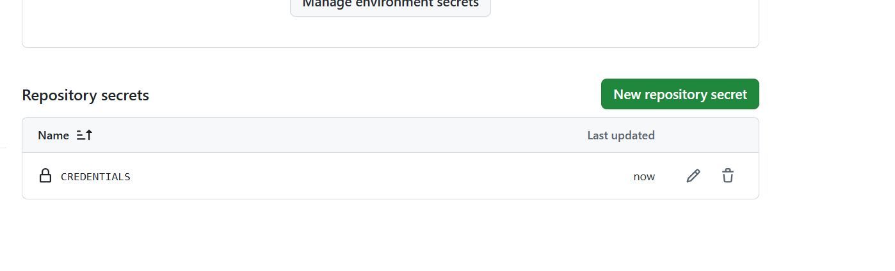
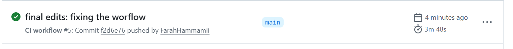
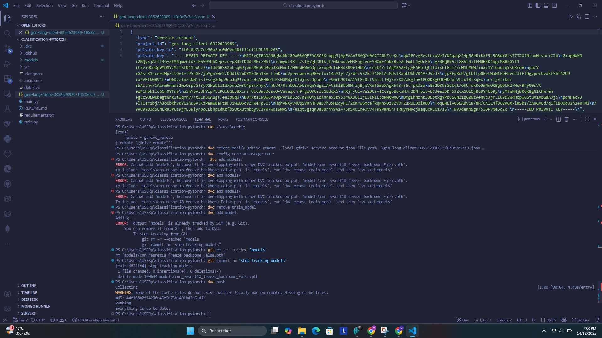
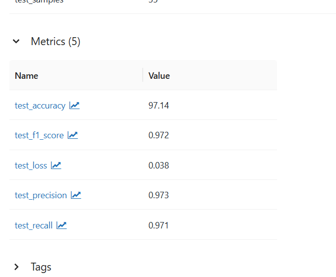

# Machine Learning Workflow Setup Report
## DVC, Google Drive, GitHub Actions & MLflow Integration

**Author:** Farah  Hammami 
**Date:** December 10, 2025  
**Project:** Image Classification with PyTorch  
**Repository:** [classification-pytorch](https://github.com/FarahHammamii/classification-pytorch)

---

## Executive Summary

This report documents the complete implementation of a professional machine learning workflow integrating Data Version Control (DVC), Google Drive storage, GitHub Actions for CI/CD, and MLflow for experiment tracking. The system addresses critical challenges in ML projects including large dataset management, experiment reproducibility, and automated training pipelines.

**Key Achievements:**
- Successfully configured DVC with Google Drive as remote storage
- Implemented automated CI/CD pipeline using GitHub Actions
- Established MLflow tracking for experiment management
- Achieved reproducible ML workflows across different environments
- Documented complete setup process for team collaboration

---

## Table of Contents

1. [Project Overview](#1-project-overview)
2. [Google Cloud Platform Setup](#2-google-cloud-platform-setup)
3. [Google Drive Configuration](#3-google-drive-configuration)
4. [Local Development Environment](#4-local-development-environment)
5. [DVC Implementation](#5-dvc-implementation)
6. [GitHub Actions Integration](#6-github-actions-integration)
7. [MLflow Experiment Tracking](#7-mlflow-experiment-tracking)
8. [Conclusion](#10-conclusion)

---

## 1. Project Overview

### 1.1 Objectives

The primary goal of this project was to establish a robust ML workflow that enables:
- Version control for large datasets (>100MB)
- Centralized cloud storage for team collaboration
- Automated training and testing pipelines
- Comprehensive experiment tracking and comparison
- Reproducible results across different environments

### 1.2 Technology Stack

| Component | Technology | Purpose |
|-----------|-----------|---------|
| **Version Control** | Git + DVC | Code and data versioning |
| **Storage Backend** | Google Drive | Scalable cloud storage |
| **CI/CD** | GitHub Actions | Automated workflows |
| **Experiment Tracking** | MLflow | Model management and metrics |
| **ML Framework** | PyTorch | Deep learning implementation |
| **Cloud Platform** | Google Cloud | Service account management |


---

## 2. Google Cloud Platform Setup

### 2.1 Project Creation

The first step involved creating a dedicated Google Cloud project to manage authentication and API access.

**Steps Completed:**
1. Accessed Google Cloud Console at https://console.cloud.google.com/
2. Created new project: `datamanagement-480817`
3. Selected the project as the active workspace

### 2.2 Service Account Configuration

A service account was created to enable programmatic access to Google Drive without requiring interactive authentication.

**Configuration Details:**
- **Service Account Name:** `farahusername`
- **Email:** `farahusername@datamanagement-480817.iam.gserviceaccount.com`
- **Role:** Editor access for Google Drive operations
- **Authentication:** JSON key file


*Figure 1: Service account creation in Google Cloud Console*

**Key Actions:**
- Created service account in IAM & Admin section
- Generated JSON credentials file
- Downloaded credentials for local configuration
- **Security Note:** Credentials file excluded from Git repository

### 2.3 API Activation

Enabled Google Drive API to allow DVC interaction with Google Drive storage.


*Figure 2: Google Drive API enabled in the project*

---

## 3. Google Drive Configuration


- **Location:** Shared Drive
- **Shared folder Name:** `ml-datasets`
- **Sharing:** Service account granted Editor permissions
- **Folder ID:** `1URKIkoMxjbmwTctt2x_hmgMaJjpEXL9o`


*Figure 3: Shared folder configuration in Google Drive*

**Access Verification:**
- Service account email added to folder permissions
- Editor role assigned for read/write operations
- Folder ID extracted from URL for DVC configuration

---

## 4. Local Development Environment


**Fork and Clone:**
```bash
git clone https://github.com/FarahHammamii/classification-pytorch
cd classification-pytorch
```


## 5. DVC Implementation

### 5.1 Initialization

```bash
dvc init
```

**Result:** Created `.dvc/` directory with configuration files.

### 5.2 Data Versioning

**Dataset Preparation:**
- Organized images in `train/`, `test/`, subdirectories


**Adding Data to DVC:**
```bash 
dvc add data
```


*Figure 4: Adding data to DVC tracking*

**What Happened:**
- Created `data.dvc` file (small pointer)
- Added `data/` to `.gitignore`
- Actual data files excluded from Git
- Only metadata tracked in version control

### 5.3 Remote Storage Configuration

```bash
dvc remote add -d gdrive_remote gdrive://1URKIkoMxjbmwTctt2x_hmgMaJjpEXL9o

# Configure service account authentication
dvc remote modify gdrive_remote gdrive_use_service_account true
dvc remote modify gdrive_remote gdrive_acknowledge_abuse true

# Set local credentials path (not committed to Git)
dvc remote modify gdrive_remote --local \
  gdrive_service_account_json_file_path key.json

# Enable automatic staging 
dvc config core.autostage true
```

**Configuration Files:**
- `.dvc/config` - Shared team configuration (in Git)
- `.dvc/config.local` - Personal credentials (not in Git)

### 5.4 Model Versioning

```bash
# Track trained models with DVC
dvc add models/


# Commit
git add models.dvc .gitignore
git commit -m "Add models to DVC tracking"
```

### 5.5 Pushing to Remote Storage

```bash

dvc push
```


**Performance:** ~10 minutes (as documented).

### 5.6 Git Repository Updates

```bash
git add .dvc/config .dvc/.gitignore data.dvc models.dvc
git commit -m "Configure DVC with Google Drive remote"
git push origin main
```

*Figure 5: Repository secrets configuration for CI/CD*
---

## 6. GitHub Actions Integration

### 6.1 Secret Configuration

To enable GitHub Actions to access Google Drive during automated workflows, credentials were added as repository secrets.

**Steps:**
1. Navigated to repository **Settings** → **Secrets and variables** → **Actions**
2. Created new repository secret: `GDRIVE_CREDENTIALS_DATA`
3. Pasted complete JSON content from service account credentials file


*Figure 6: Repository secrets configuration for CI/CD*
**Workflow Trigger:**
- Push to main branch
- Pull request creation
- Manual workflow dispatch


*Figure 7: Successful  CI workflow*

---

## 7. MLflow Experiment Tracking

### 7.1 MLflow Setup

**Server Launch:**
```bash
mlflow ui --host localhost --port 5000
```

**Important Note:** Accessing MLflow UI requires using `http://localhost:5000` 

### 7.2 Code Integration

**Upstream Repository Update:**
```bash
# Add original repository as upstream
git remote add upstream https://github.com/besmaguesmi/classification-pytorch.git

# Fetch latest changes (includes MLflow support)
git fetch upstream

# Merge updates
git checkout main
git merge upstream/main

# Push to personal fork
git push origin main
```

### 7.3 Training with MLflow

**Training Command:**
```bash
python main.py --mode train --data_path data/train --use_mlflow
```

**Tracked Information:**
- **Parameters:** Learning rate, batch size, backbone architecture, number of epochs
- **Metrics:** Training loss, validation loss, training accuracy, validation accuracy
- **Artifacts:** Model checkpoints, loss curves, training history
- **Models:** Versioned PyTorch models with metadata


*Figure 8: MLflow UI showing multiple training runs with batch size parallel coordinates visualization*

*Figure 9: comparative diagram showing different value loss across validation runs*


### 7.4 Testing with MLflow

**Testing Command:**
```bash
python main.py --mode test \
  --data_path data/test \
  --model_path models/best_model.pth \
  --use_mlflow
```

**Test Metrics Tracked:**
- **Accuracy:** 97.14%
- **Precision:** 0.973
- **Recall:** 0.971
- **F1 Score:** 0.972
- **Test Loss:** 0.038


*Figure 10: Detailed test metrics from MLflow experiment*

### 7.5 Experiment Comparison

MLflow's UI enables comparison of multiple runs to identify optimal hyperparameters.

**Comparison Metrics:**
- Batch size impact on training loss
- Validation loss across different configurations
- Best performing model identification


**Key Findings:**
- Best validation loss: 0.57 (fold_2)
- Most stable training: batch_size=15
- Optimal learning rate identified through parallel coordinates

---


## 8. Conclusion

### 8.1 Project Success

This project successfully established a complete professional ML workflow integrating:
- **DVC for data versioning** - Large datasets managed outside Git
- **Google Drive storage** - Cost-effective cloud storage solution
- **GitHub Actions CI/CD** - Automated training pipelines
- **MLflow tracking** - Comprehensive experiment management
- **Reproducible workflows** - Consistent results across environments

### 8.2 Key Achievements

1. **Efficient Storage Management**
   - data and models stored in Google Drive
   - Only few of metadata tracked in Git
   - Cost-effective solution using free tier

2. **Experiment Reproducibility**
   - Complete experiment history logged in MLflow
   - Easy comparison of different model configurations
   - Automated metric tracking and visualization

3. **Team Collaboration Ready**
   - Shared Google Drive folder for data access
   - GitHub repository for code collaboration
   - GitHub Actions for consistent training environment
   - MLflow for shared experiment results

4. **Production-Ready Pipeline**
   - Automated CI/CD workflows
   - Version-controlled models and datasets
   - Comprehensive logging and monitoring

### 8.3 Learning Outcomes

**Technical Skills Acquired:**
- DVC configuration and remote storage setup
- Google Cloud Platform service account management
- GitHub Actions workflow implementation
- MLflow experiment tracking integration
- Git workflow with multiple remotes (origin/upstream)

**Best Practices Learned:**
- Never commit credentials to Git repositories
- Use `.gitignore` effectively for DVC-tracked files
- Separate global and local DVC configurations
- Document workflow for team onboarding
- Test reproducibility on fresh environments


### 8.3 Final Thoughts

This project demonstrates that professional ML workflows are achievable with open-source tools and free-tier cloud services. The combination of DVC, Google Drive, GitHub Actions, and MLflow provides a robust foundation for reproducible, collaborative machine learning projects.

The workflow established here can scale from individual research projects to production-ready systems, making it an invaluable setup for both academic and industry applications.
