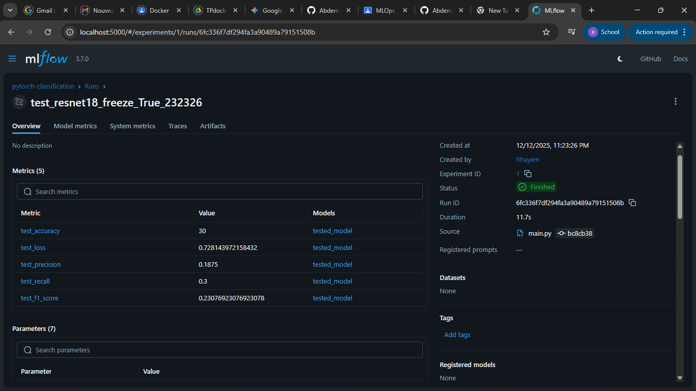
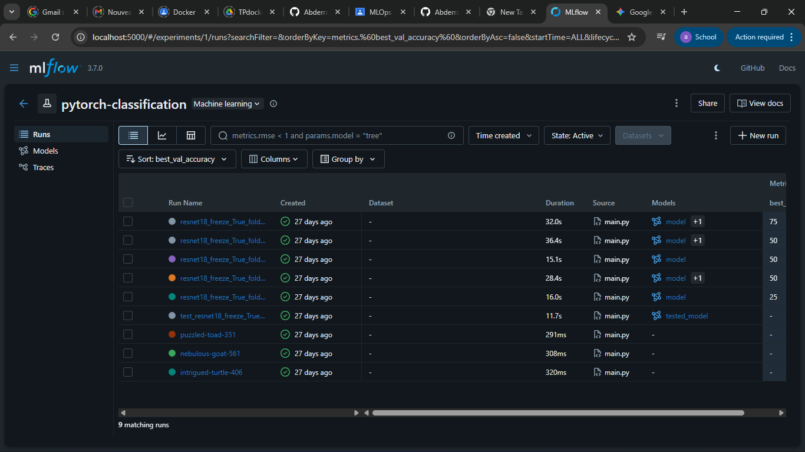
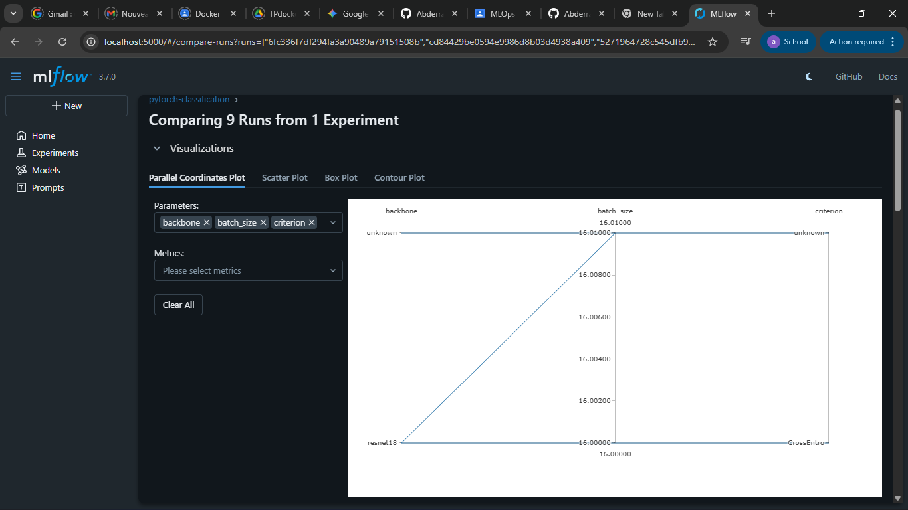

# DVC + MLflow Report: Image Classification with PyTorch

Created By: Neji. Abderrahim CI2

---

## 1) Context & Objective

DVC and MLflow were used for an end to end image classification project with PyTorch.

## 2) Environment

Virtual Environment: .venv

To install dependences run:

```bash
pip install -r requirements.txt
```

To check what versions of pytorch and mlflow you have run:

```bash
python -c "import torch; import mlflow; print(torch.__version__, mlflow.__version__)"
```

## 3) DVC and Data Setup

3.1 Google Cloud - GCP
To use DVC remote storage, GCP Service Accounts had to be configured.


"Here is an image of how the GCP project named 'datamanagement' was chosen to hold the Service Account and manage the resources needed."


"Here is an image of how the specific Service Account named 'AbderrahimNeji' was created to act as the authenticated identity for DVC operations."


"Here is an image showing how to generate the JSON file as the private key used to authenticate both the local environment and CI/CD pipelines against GCP Services."

3.2 Google Drive Setup
The Data is stored in a google drive folder named gdrive_remote which is managed as a shared drive providing data preservation.


"This image shows how the location of the remote storage was created on Google Shared Drive where the data can be preserved and accessed by many collaborators."

Structure of Drive


"This image shows the structure of the drive and how DVC will store versioned datasets."


"The previously mentioned Service Account has been given 'Content Manager' permission."

3.3 DVC Commands

- Pull data:

  ```bash
  python -m dvc pull

  ```

- Expected layout:
  data/
  train/<class1|class2|…>/
  test/<class1|class2|…>/

- Track updates:
  ```bash
  python -m dvc add data
  python -m dvc push

  ```

## 4) MLflow

- UI Command:
  ```bash
  mlflow ui --host 0.0.0.0 --port 5000
  ```

http://localhost:5000

Experiment: pytorch-classification


"The MLflow User Interface displaying the 'pytorch-classification' experiment, tracking multiple runs, hyperparameters, and accuracy metrics."



"Detailed view of a specific test run in MLflow, displaying key performance metrics such as test accuracy (30%), loss, and F1-score."

Experiment Tracking: The interface below shows the tracked runs, including metrics (accuracy, loss) and parameters (folds, backbone freezing).

## 5) Training

- Command:
  ```bash
  python main.py --mode train --data_path data/train --use_mlflow

  ```

Models produced:
models/cnn_resnet18_freeze_backbone_True_fold_0..4.pth

## 6) Testing / Evaluation

- Example (fold 3):
  ```bash
  python main.py --mode test \
  --data_path data/test \
  --model_path models/cnn_resnet18_freeze_backbone_True_fold_3.pth \
  --use_mlflow
  ```

## 7) Results & Analysis

Best run (by best_val_accuracy):
run_id: 408acb4f6a014991b3624747f9e48233



"Leaderboard of experiment runs sorted by best_val_accuracy, highlighting the top-performing model (Fold 3) which achieved 75% accuracy."

fold: 3
best_val_accuracy: 75.0
artifact_uri: mlflow-artifacts:/1/408acb4f6a014991b3624747f9e48233/artifacts

Best val accuracy per fold:
Fold 3: 75.0
Fold 4: 50.0
Fold 1: 50.0
Fold 0: 50.0
Fold 2: 25.0

Recommended model: models/cnn_resnet18_freeze_backbone_True_fold_3.pth



"Parallel Coordinates Plot visualizing the relationship between hyperparameters (like backbone and batch size) and model metrics across 9 different runs."

Observations:
Freezing the backbone improves stability with a small dataset.
Moderate LR avoids oscillations and helps convergence.
High variance across folds is expected with limited data.

## 8) Registry & Artifacts

Model registry name: resnet18_classifier (versions 1..4).

Local artifacts: mlartifacts/1/<run_id>/artifacts/... (models, plots, histories, reports).

## 9) Git & CI

- Typical commit:
  ```bash
  git add data.dvc .gitignore src/datasets.py train.py
  git commit -m "Auto-detect classes; add MLflow runs"
  ```


"Configuration of GitHub Actions Secrets (GDRIVE_CREDENTIALS_DATA) to securely store the Service Account key for CI/CD data access."
