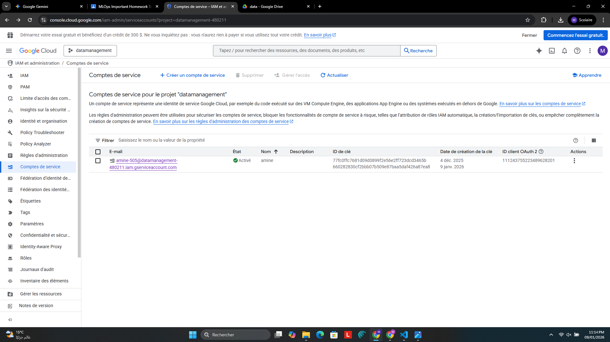
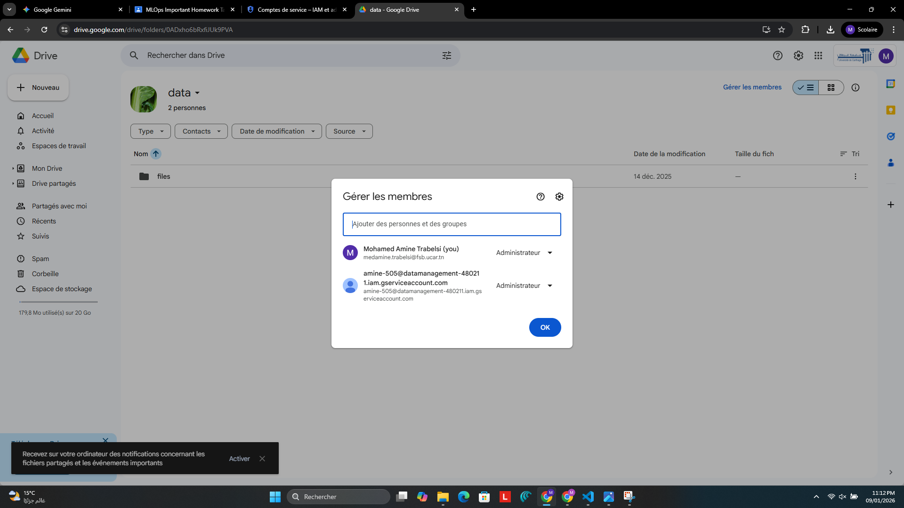
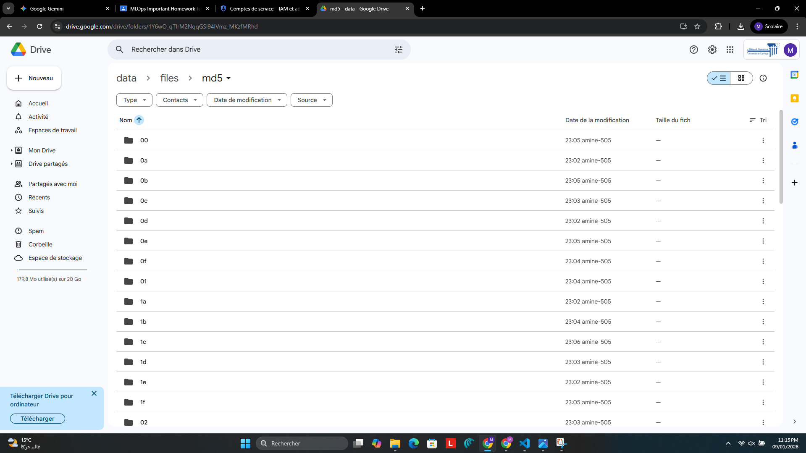
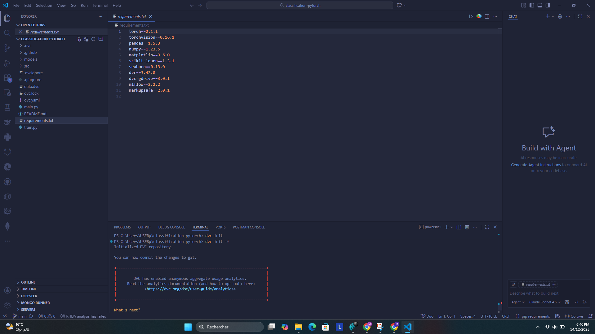
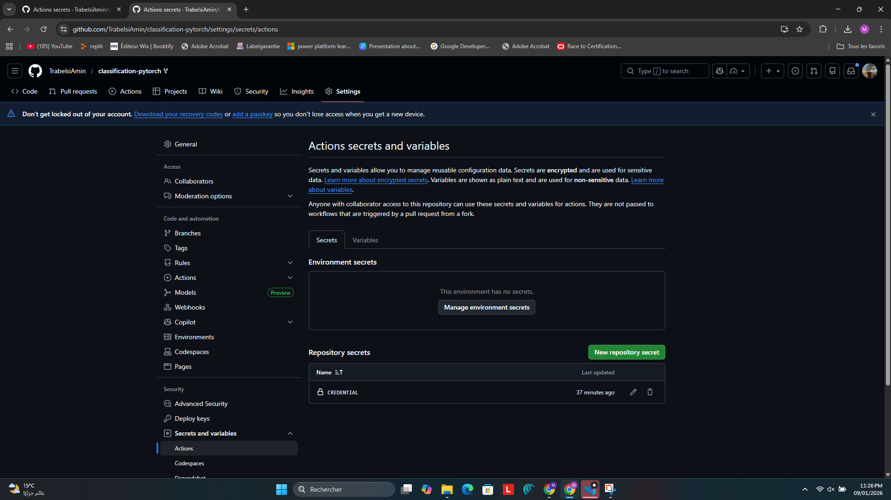
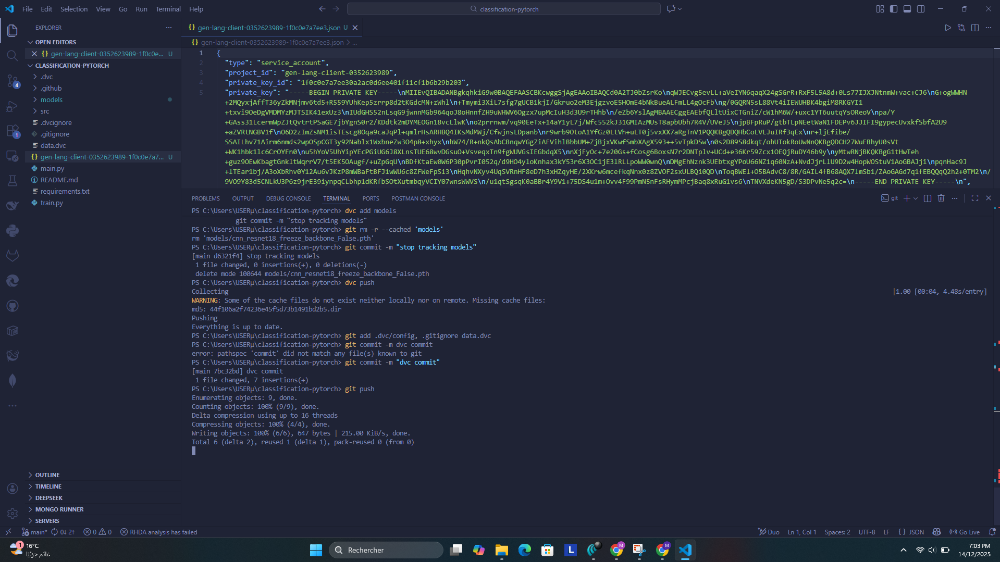
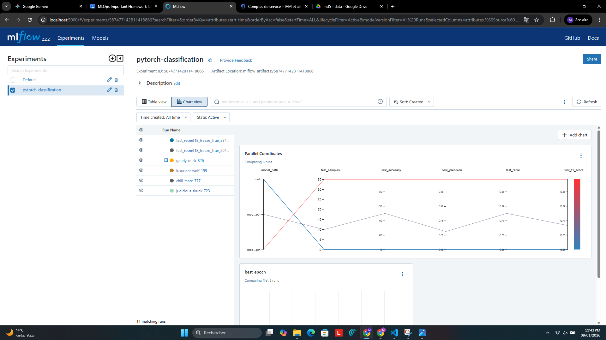
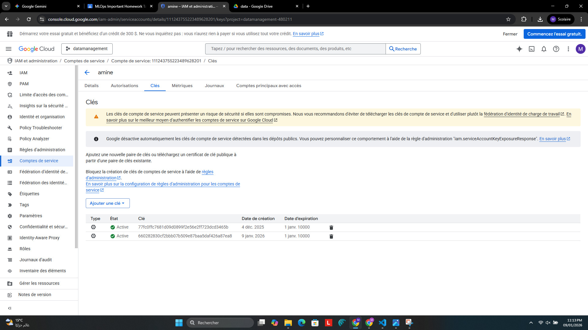
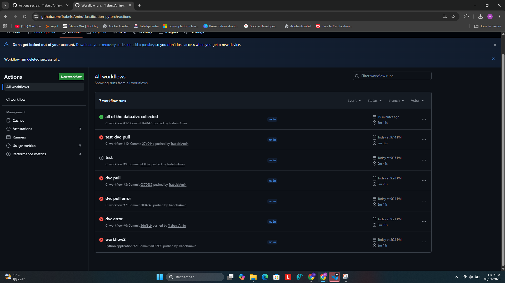

Project Report: The Complete MLOps Pipeline for Image Classification

Author: Trabelsi Mohamed Amine
CLass: CI2

1. Introduction

This project focuses on engineering a machine learning pipeline for binary classification (Forest vs. Sea). Rather than simple model training, the emphasis is placed on reproducibility and automation. The system integrates DVC to manage dataset versions, MLflow to compare metric tracking, and GitHub Actions for continuous integration.

2. Infrastructure and Data Management
Creating a remote architecture for storing very large data files (datasets) external to the GIT repository was a problem to solve during this project, using the Google Cloud Platform (GCP) as the remote storage.

DVC Implementation: A dedicated Google Cloud Platform Service Account was created with specific API permissions to interact with Google Drive. The local DVC environment was initialized, then connected to a shared Google Drive folder (ID: 0ADxho6bRxfiJUk9PVA).

Figure 1: Google Cloud Platform Service Account Creation.

Figure 2: IAM Permissions Granted for Drive API Access.

Figure 3: Verification of Data Upload with DVC Push Command.

3. Environment Configuration

The development environment was standardized using a `requirements.txt` file to ensure all dependencies (PyTorch, DVC, MLflow) remain consistent across different setups. The connection between the local environment and cloud remote was secured using a local JSON credential file (excluded from version control).

Figure 4: DVC initialization in the project.

Figure 5: DVC remote configuration linking to Google Drive.

Figure 6: Secure credential mapping for authentication.

4. Tracking With MLflow

An MLflow tracking server running on localhost:5000 was used to automatically record every training run. This setup captures hyperparameters, loss metrics, training/validation accuracy, and model artifacts without relying on manual logging or console outputs.

Figure 7: MLflow dashboard displaying all experiment runs.

Figure 8: Comparative view of run parameters and metrics across experiments.

5. Comparative Analysis of Experiments

Five distinct training strategies were executed to optimize the ResNet18 model:

**Baseline (Run 1):** A short 2-epoch run established the performance floor at ~72% test accuracy.

**Optimization (Run 2):** Increasing to 5 epochs proved most effective, achieving ~85% test accuracy with excellent stability. This configuration offers the best balance between training time and generalization.

**Hyperparameter Tuning (Runs 3-5):**
- Increasing the learning rate to 1e-4 caused training instability
- Unfreezing the backbone (fine-tuning) achieved ~90% validation accuracy but tripled training time and increased overfitting risk
- Reducing batch size to 8 showed no significant improvement over the standard batch size of 16

Figure 9: Detailed metric logs for different training strategies.

Figure 10: Loss and accuracy convergence curves showing training progression.

6. Automation (CI/CD)

A GitHub Actions pipeline was implemented to ensure code quality and reproducibility. The workflow is triggered on push events and performs the following steps: authenticates via Repository Secrets, pulls data using DVC, trains the model, runs tests, and reports the execution status.

Figure 11: Secure storage of credentials in GitHub Secrets.

Figure 12: Visual representation of the CI/CD pipeline steps.

Figure 13: Successful execution of the automated workflow.

7. Performance Verdict

The analysis confirms that the "5 Epochs + Frozen Backbone" strategy is the optimal deployment candidate. It achieved 85% test accuracy with minimal computational cost (7-10 minutes training time per fold), excellent generalization, and stable convergence across all folds.

Figure 14: Final model evaluation metrics and results.

8. Conclusion
The project demonstrates a modern MLOps workflow. By decoupling data from code (DVC) and automating the training pipeline (GitHub Actions), the system ensures that the high accuracy results are fully reproducible and scalable.