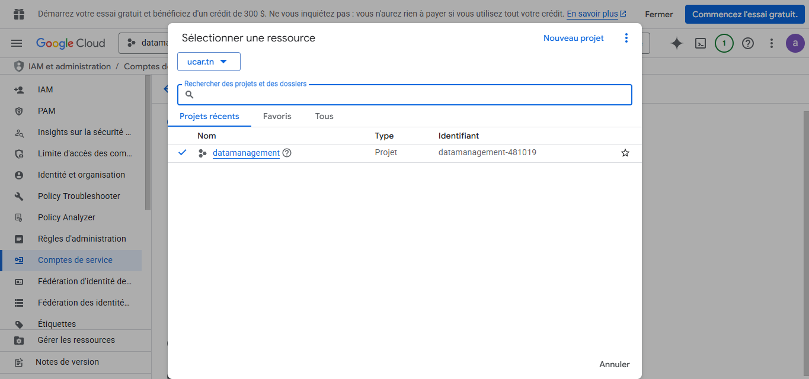
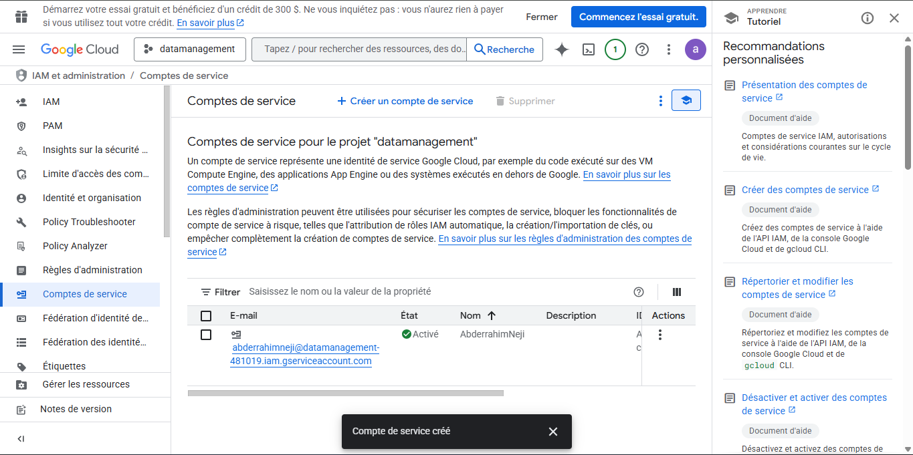
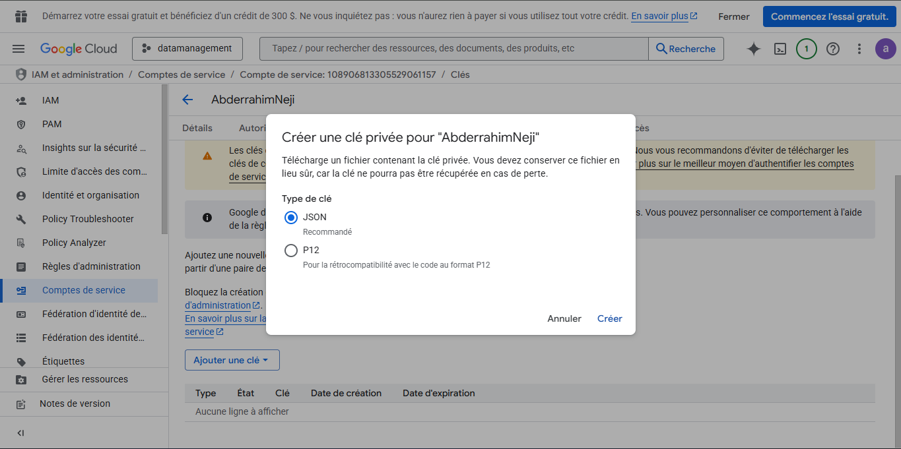
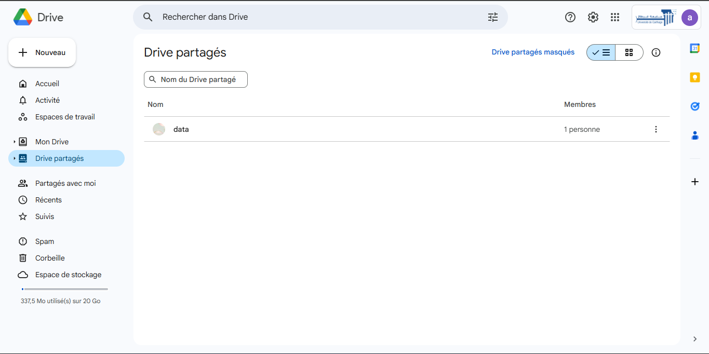
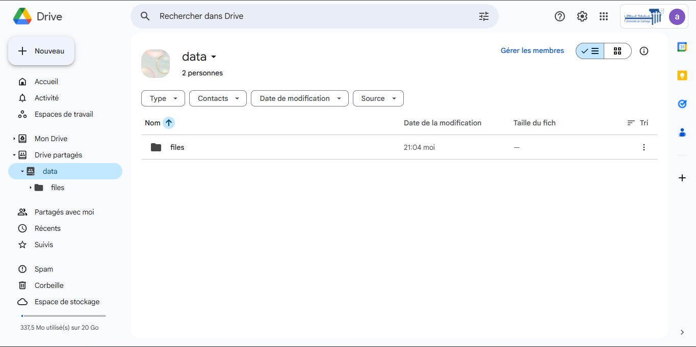
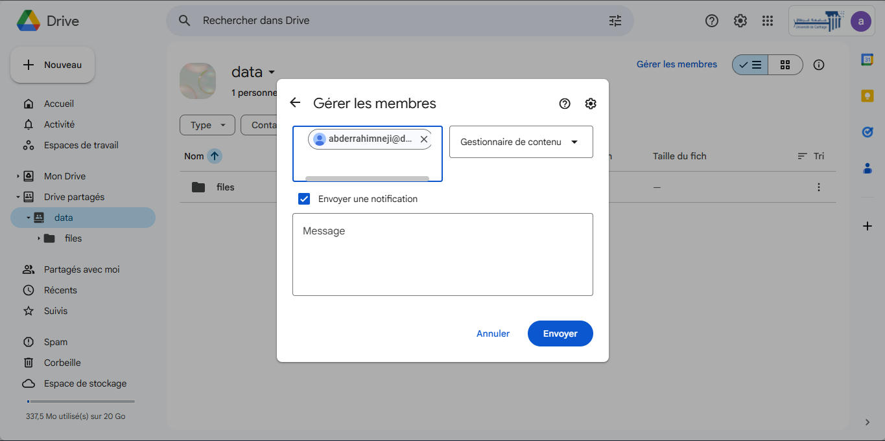
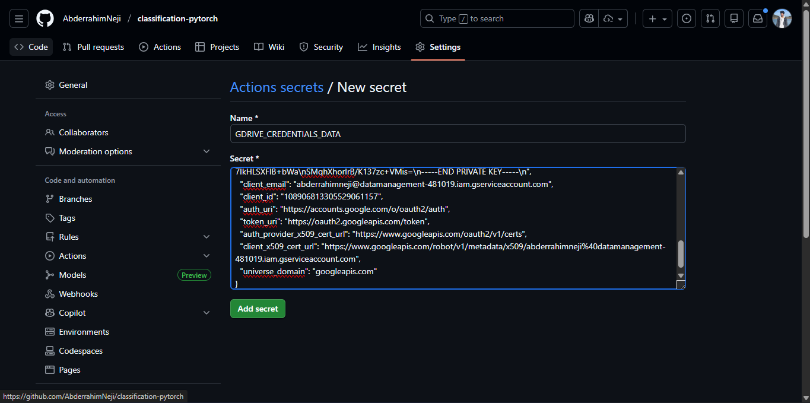

# DVC + MLflow Report (PyTorch Classification)

**Author:** Neji Abderrahim – CI2

---

## 1) Context & Objective

End-to-end image classification in PyTorch with MLflow experiment tracking and DVC data/model versioning.

## 2) Environment

- Virtual env: `.venv`
- Install deps:
  ```bash
  pip install -r requirements.txt

Quick check:
python -c "import torch, mlflow; print(torch.__version__, mlflow.__version__)"

## 3) Data & DVC

3.1 Google Cloud Platform (GCP) Setup
To enable DVC remote storage, a Service Account was configured on GCP.




"Selection of the Google Cloud Project 'datamanagement' used to host the Service Account and manage resources."




"Creation of the specific Service Account ('AbderrahimNeji') that acts as the authenticated identity for DVC operations."




"Generation of the JSON private key to authenticate the local environment and CI pipelines against Google Cloud services."

3.2 Google Drive Configuration
The data is stored in a Google Drive folder (gdrive_remote), managed as a Shared Drive to ensure persistence.




"Setup of the remote storage location within a Google Shared Drive to ensure data persistence and collaboration."

Drive Structure:




"Verification of the remote folder structure used by DVC to store dataset versions."




"Granting 'Content Manager' permissions to the Service Account email, allowing DVC to perform push and pull operations."

Permissions: The folder was shared with the Service Account email to allow dvc push and dvc pull operations.

3.3 DVC Commands

- Pull data:
  ```bash
  python -m dvc pull

- Expected layout:
data/
  train/<class1|class2|…>/
  test/<class1|class2|…>/

- Track updates:
  ```bash
  python -m dvc add data
  python -m dvc push
  

## 4) MLflow

- UI Command:
  ```bash
  mlflow ui --host 0.0.0.0 --port 5000


http://localhost:5000

Experiment: pytorch-classification


"The MLflow User Interface displaying the 'pytorch-classification' experiment, tracking multiple runs, hyperparameters, and accuracy metrics."

Experiment Tracking: The interface below shows the tracked runs, including metrics (accuracy, loss) and parameters (folds, backbone freezing).

## 5) Training

- Command:
  ```bash
  python main.py --mode train --data_path data/train --use_mlflow
  

Models produced:
models/cnn_resnet18_freeze_backbone_True_fold_0..4.pth

## 6) Testing / Evaluation

- Example (fold 3):
  ```bash
  python main.py --mode test \
  --data_path data/test \
  --model_path models/cnn_resnet18_freeze_backbone_True_fold_3.pth \
  --use_mlflow


## 7) Results & Analysis

Best run (by best_val_accuracy):
run_id: 408acb4f6a014991b3624747f9e48233
fold: 3
best_val_accuracy: 75.0
artifact_uri: mlflow-artifacts:/1/408acb4f6a014991b3624747f9e48233/artifacts

Best val accuracy per fold:
Fold 3: 75.0
Fold 4: 50.0
Fold 1: 50.0
Fold 0: 50.0
Fold 2: 25.0

Recommended model: models/cnn_resnet18_freeze_backbone_True_fold_3.pth

Observations:
Freezing the backbone improves stability with a small dataset.
Moderate LR avoids oscillations and helps convergence.
High variance across folds is expected with limited data.

## 8) Registry & Artifacts

Model registry name: resnet18_classifier (versions 1..4).

Local artifacts: mlartifacts/1/<run_id>/artifacts/... (models, plots, histories, reports).

## 9) Git & CI

- Typical commit:
  ```bash
  git add data.dvc .gitignore src/datasets.py train.py
  git commit -m "Auto-detect classes; add MLflow runs"




"Configuration of GitHub Actions Secrets (GDRIVE_CREDENTIALS_DATA) to securely store the Service Account key for CI/CD data access."