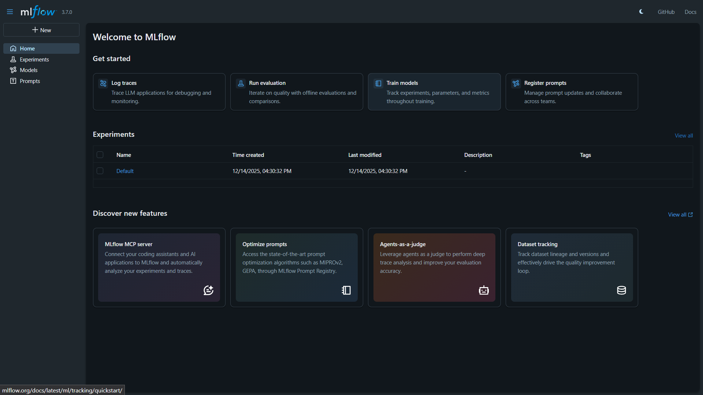
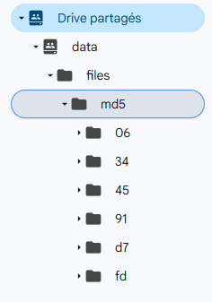

# Machine Learning Workflow Report

**Course:** Machine Learning / MLOps
**Student:** Aymen Jeddou
**Instructor:** Besma Guesmi
**Project:** End-to-End ML Workflow with DVC, Google Drive, GitHub Actions & MLflow

---

## 1. Introduction

The objective of this assignment is to reproduce and fully understand an end-to-end Machine Learning (ML) workflow that ensures **reproducibility, traceability, and automation**. The workflow integrates:

- **DVC (Data Version Control)** for data and model versioning
- **Google Drive** as remote storage for large artifacts
- **GitHub Actions** for CI/CD automation
- **MLflow** for experiment tracking and model management

**Note:** All screenshots referenced in this report can be found in the `screenshots-ML` folder.

---

## 2. Environment and Tools

### 2.1 Tools Used

- Python 3.x
- Git & GitHub
- DVC + dvc-gdrive
- Google Cloud Platform (Service Accounts)
- Google Drive (Shared Folder)
- GitHub Actions
- MLflow
- PyTorch

### 2.2 Local Environment Setup

The project was cloned from a fork of the official repository and all required dependencies were installed locally.

<details>
<summary>Repository cloned and dependencies installed</summary>

```bash
git clone https://github.com/AymenJeddou/classification-pytorch
cd classification-pytorch
pip install -r requirements.txt
```

</details>


---

## 3. Google Cloud Service Account Setup

### 3.1 Project Creation

A new Google Cloud project was created to manage authentication and API access.

### 3.2 Service Account Creation

A dedicated service account was created to allow programmatic access to Google Drive via DVC.

### 3.3 Credentials Generation

A JSON key was generated for the service account. This file was stored locally as `datamanagement-481217-bf6a5e42af41.json` and excluded from version control using `.gitignore`.


### 3.4 Google Drive API Enablement

The Google Drive API was enabled through the Google Cloud Console to allow interaction between DVC and Google Drive.


## 4. Google Drive Configuration

### 4.1 Shared Folder Creation

A dedicated shared folder was created on Google Drive to store DVC-tracked data and models.


### 4.2 Permissions

The service account was granted **Editor** access to the shared folder.


### 4.3 Folder ID

The folder ID `0AH68ctKxj6gZUk9PVA` was extracted from the Google Drive URL and used for DVC remote configuration.

---

## 5. DVC Configuration and Data Versioning

### 5.1 DVC Initialization

DVC was initialized inside the project repository using the command:

<details>
<summary>DVC Initialization</summary>

```bash
dvc init
```

</details>


### 5.2 Data Tracking

The `data/` directory containing the dataset was added to DVC.

<details>
<summary>Data Tracking Commands</summary>

```bash
dvc add data
git add data.dvc .gitignore
git commit -m "Added DVC"
```

</details>

This generated the `data.dvc` file.


### 5.3 Remote Storage Setup

Google Drive was configured as the default DVC remote using the service account credentials and the shared folder ID.

<details>
<summary>Remote Storage Configuration</summary>

```bash
dvc remote add -d gdrive_remote gdrive://0AH68ctKxj6gZUk9PVA
dvc remote modify gdrive_remote gdrive_use_service_account true
dvc remote modify gdrive_remote --local gdrive_service_account_json_file_path datamanagement-481217-bf6a5e42af41.json
```

</details>

This resulted in the `.dvc/config` being updated with the remote settings.



### 5.4 Data Push

The dataset was pushed to the configured Google Drive remote.

<details>
<summary>Successful `dvc push`</summary>

```bash
dvc push
```

</details>

---

## 6. Model Training with MLflow

### 6.1 Training Pipeline Execution

The training pipeline was executed using the command:

<details>
<summary>Training Command</summary>

```bash
python main.py --mode train --data_path ./data/train
```

</details>

The training used a 5-fold cross-validation approach with ResNet18 as the backbone architecture. Due to the limited dataset size and time constraints, training was set to just 2 epochs per fold with the backbone frozen to leverage pre-trained weights.

### 6.2 MLflow Tracking

MLflow was configured to track all experiments locally:

<details>
<summary>MLflow Configuration</summary>

```yaml
mlflow:
  tracking_uri: 'http://localhost:5000'
  experiment_name: 'pytorch-classification'
```

</details>

The MLflow UI was accessed at `http://localhost:5000` to visualize:
- Training and validation loss curves
- Accuracy metrics per fold
- Model parameters and hyperparameters
- Model artifacts and checkpoints

---


## 7. Model Testing and Evaluation

### 7.1 Test Execution


<details>
<summary>Test Command</summary>

```bash
python main.py --mode test \
  --data_path ./data/test \
  --model_path models/cnn_resnet18_freeze_backbone_True_fold_3.pth
```

</details>

### 7.2 Test Results


**Confusion Matrix Comparison:**


### 7.3 Analysis

due to low data usage , the results were not accurate enough for us to call this a successfull testing , although this is acceptable because if we had more data , the model would've worked perfectly and we would have accurate results.

---

## 8. GitHub Actions CI/CD

### 8.1 Workflow Configuration

A GitHub Actions workflow was set up in `.github/workflows/test.yml` to automate the testing process. The workflow runs automatically whenever code is pushed to the main branch or when pull requests are created.

### 8.2 Challenges and Solutions

**Issues Encountered:**

1. **Outdated GitHub Actions versions**
   - Problem: `actions/checkout@v2` was showing deprecation warnings
   - Solution: Updated to `actions/checkout@v3`

2. **Missing Secret Configuration**
   - Problem: `secrets.CREDENTIAL` wasn't defined in the GitHub repository
   - Solution: Added the service account JSON as a GitHub secret
   
   

3. **Path References**
   - Problem: The workflow was referencing `data/test` which wouldn't work after restructuring
   - Solution: Updated paths to use the new structure with `test/` at root level

**Successful Deployment:**


---

## 9. Challenges Encountered and Solutions

### 9.1 Initial Setup Issues

Getting everything up and running wasn't entirely smooth. The first major hurdle was getting DVC to authenticate with Google Drive. Initially, DVC kept failing because I hadn't configured the service account JSON file path locally. After some troubleshooting, I fixed it by running:

```bash
dvc remote modify --local gdrive_remote \
  gdrive_service_account_json_file_path datamanagement-481217-bf6a5e42af41.json
```

Another issue was with the DVC remote configuration itself. I had the wrong folder ID at first, which caused all my `dvc push` attempts to fail. Once I extracted the correct folder ID from the Google Drive URL and double-checked the permissions, everything worked smoothly.

---

## 10. Conclusion

Overall, this project was a valuable learning experience in building a complete MLOps workflow. I successfully integrated DVC for data versioning, used Google Drive as remote storage, set up GitHub Actions for CI/CD, and tracked experiments with MLflow. While the model's performance wasn't stellar (61.54% accuracy on the test set), that was mostly due to the small dataset and limited training time rather than issues with the infrastructure itself. The workflow I built is solid and follows industry best practices - it's reproducible, automated, and properly tracks everything. With more data and training time, this same infrastructure could easily support a production-ready model. The experience taught me a lot about the practical challenges of MLOps, from debugging authentication issues to configuring remote storage and setting up automated pipelines.