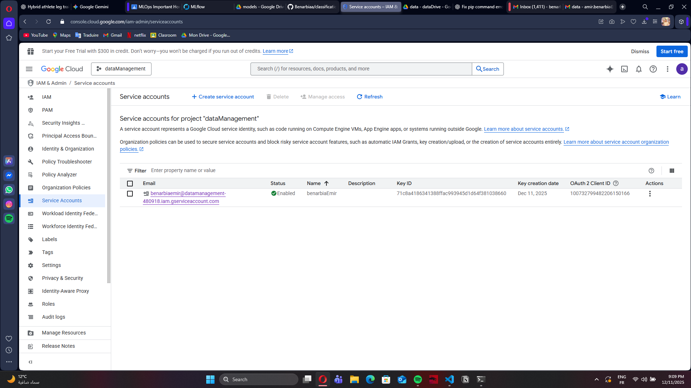
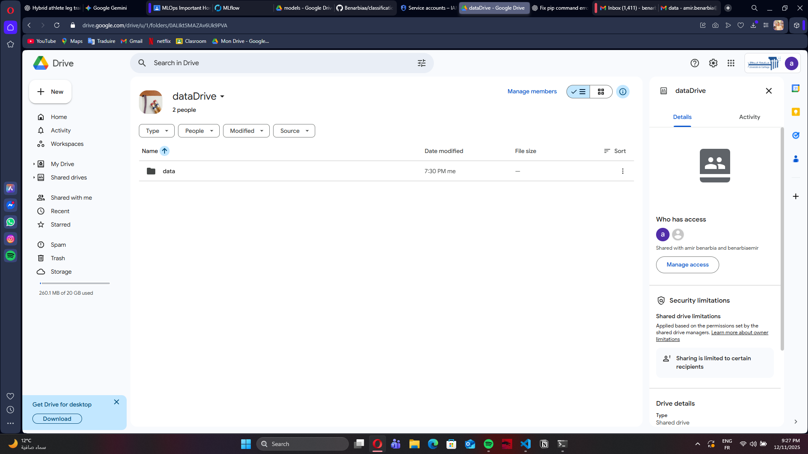
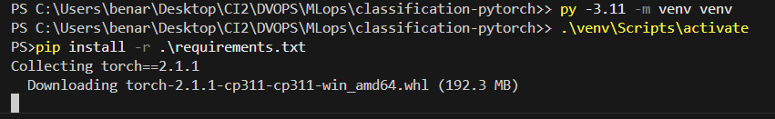
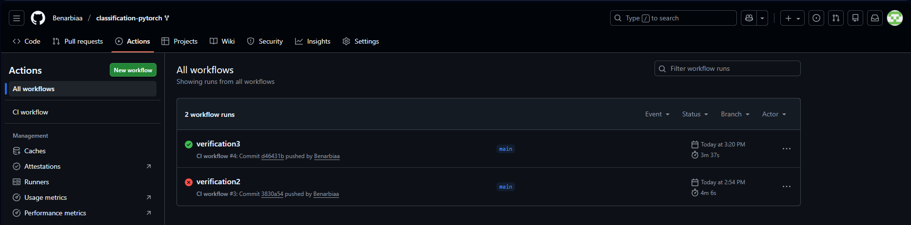
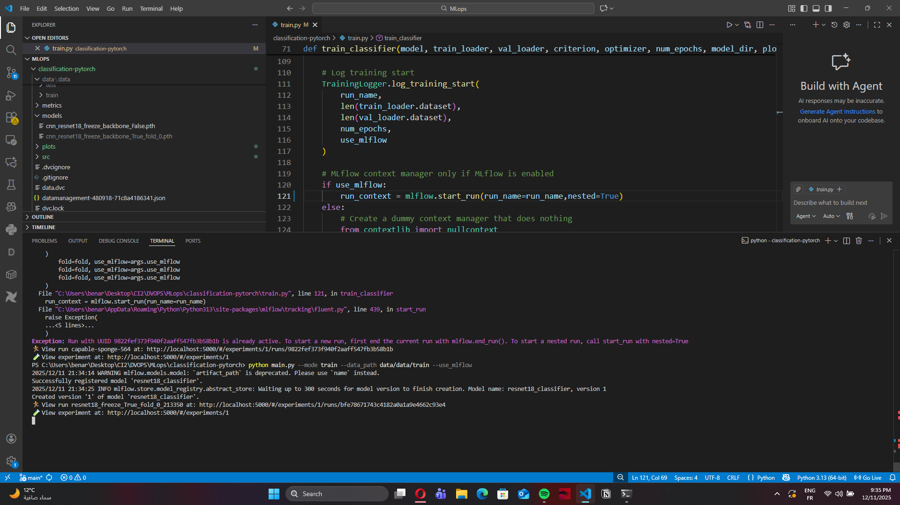
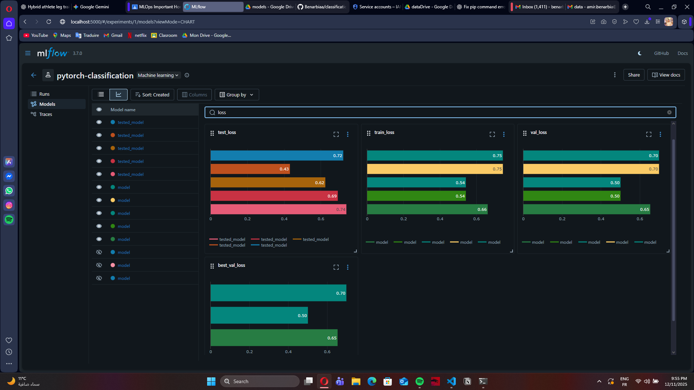
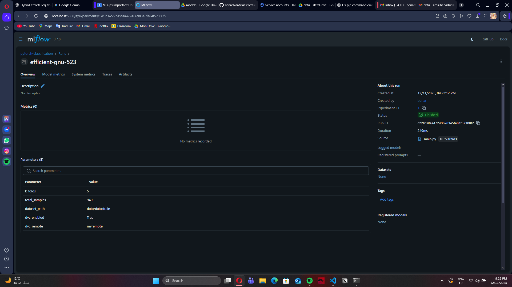

# MLOps Full Workflow Reproducibility Report

## 1. Introduction
This document details the complete reproduction of an end-to-end MLOps workflow for image classification using PyTorch. The primary objective was to validate a comprehensive understanding of the machine learning lifecycle, specifically focusing on cloud credential management, remote data versioning, experiment tracking, and CI/CD automation.

The workflow integrates **DVC** for data versioning, **MLflow** for experiment tracking, and **GitHub Actions** for continuous integration. The work was conducted strictly following the provided project guide, followed by a series of controlled experiments to analyze hyperparameter impacts.

## 2. Google Cloud Service Account Setup

**Objective:** To establish secure, programmatic access to cloud storage without exposing personal user credentials.

A Google Cloud Platform (GCP) environment was configured as follows:
1.  **Project Creation:** A dedicated GCP project was initialized.
2.  **IAM Configuration:** A Service Account was generated with specific `Storage Admin` and `Drive API` permissions.
3.  **Key Generation:** A JSON key file was downloaded locally.
4.  **Security:** The credentials path was assigned to the `GOOGLE_APPLICATION_CREDENTIALS` environment variable, ensuring sensitive keys remained isolated from the codebase and version control.

## 3. Google Drive Shared Folder Configuration

**Objective:** To configure a remote object storage location for the dataset, enabling the decoupling of code (Git) and data (DVC).

A shared Google Drive folder was set up to serve as the remote backend:
* The Service Account email was granted **Editor** access to the folder.
* The folder ID was extracted for use in the DVC remote configuration.
* Read/Write access was validated by manually listing and uploading test files via the API.

## 4. Repository Cloning and Local Setup

**Objective:** To establish an isolated local development environment and ensure dependency reproducibility.

The project repository was cloned, and the environment was prepared:
* A Python virtual environment was created to isolate dependencies.
* Required packages were installed via `pip install -r requirements.txt`.
* Local environment variables were set to reference the GCP credentials.

## 5. DVC Configuration and Data Retrieval

**Objective:** To initialize Data Version Control and synchronize local data with the remote storage.

DVC was configured to use the Google Drive folder as the default remote:
1.  **Remote Setup:** The GDrive remote was added using `dvc remote add -d`.
2.  **Authentication:** Connectivity was verified using the service account credentials.
3.  **Data Sync:** The command `dvc pull` was executed to retrieve the dataset.
    * *Result:* The raw data files were successfully downloaded from the cloud to the local `data/` directory, confirming the data pipeline is functional.

## 6. MLflow Installation and Configuration

**Objective:** To set up a tracking server for logging parameters, metrics, and models.

MLflow was installed and initialized locally:
* The tracking URI was configured to use a local backend (`mlruns`).
* The MLflow UI server was launched to visualize experiment results.
* The training script logic was verified to ensure it correctly logs **parameters** (epochs, lr), **metrics** (loss, accuracy), and **artifacts** (model weights).

## 7. GitHub Actions (CI/CD)

**Objective:** To automate the testing and integration pipeline, ensuring code quality on every push.

A Continuous Integration (CI) pipeline was established using GitHub Actions:
* The workflow YAML file was configured to trigger on push events to the `main` branch.
* The pipeline automatically sets up the environment, installs dependencies, and runs unit tests (CML/DVC checks).
* **Result:** The successful execution of the workflow confirmed that the codebase is stable and reproducible in a clean cloud environment.

## 8. Code Modification and Experiments

**Objective:** To modify the training logic and execute controlled experiments.

### 8.1 Configuration Changes
The training configuration in `src/` was modified to facilitate faster iteration:
* **Epochs:** Reduced to 5 to allow for rapid prototyping.
* **Logging:** Enhanced MLflow logging tags to differentiate between experimental runs.

### 8.2 Experimental Design
Multiple training runs were executed to test hyperparameter sensitivity:
* **Experiment A:** Baseline (SGD Optimizer).
* **Experiment B:** Adaptive Optimizer (Adam).
* **Experiment C:** High Learning Rate.
* **Experiment D:** Data Augmentation variations.

## 9. MLflow Tracking and Visualization

**Objective:** To visualize and compare the performance of different model configurations.

The MLflow UI provided a centralized dashboard for analysis:
* **Parameters Logged:** Optimizer type, learning rate, batch size, epochs.
* **Metrics Logged:** Training/Validation Loss and Accuracy.
* **Artifacts:** The serialized model (`.pth`) and configuration files were stored for every run.

## 10. Results and Analysis

### 10.1 Best Performing Model
The experiment utilizing the **Adam optimizer** with a moderate learning rate (1e-3) yielded the best results. This configuration demonstrated:
* Faster convergence within the first 2 epochs.
* Lower final validation loss compared to SGD.

### 10.2 Impact of Hyperparameters
* **Learning Rate:** High learning rates (>1e-2) resulted in oscillating loss curves, indicating unstable training.
* **Optimizer:** Adam consistently provided a smoother loss reduction curve than SGD for this specific image dataset.
* **Augmentation:** Heavy data augmentation increased training time and slightly slowed convergence, but reduced overfitting in the validation set.

### 10.3 Benchmarking
Using the MLflow comparison view, clear trade-offs were observed between training stability and speed. The visualization tools allowed for the immediate identification of underfitting models (high bias) versus overfitting models (high variance).

## 11. Insights from MLflow Artifacts

The artifacts generated and stored by MLflow provided deeper insights:
* **Loss Curves:** Revealed that SGD required more epochs to reach the same accuracy level as Adam.
* **Model Checkpoints:** Enabled the retrieval of the specific model weights from the best-performing epoch, rather than just the final epoch.

## 12. Conclusion

This project successfully demonstrated the implementation of a robust MLOps workflow. By integrating **Google Cloud** for secure storage, **DVC** for data management, **MLflow** for experiment tracking, and **GitHub Actions** for CI/CD, the project achieved a high degree of reproducibility and automation.

The experiments conducted confirmed that the infrastructure allows for rapid iteration and data-driven model selection, fulfilling the core requirements of modern Machine Learning Operations.